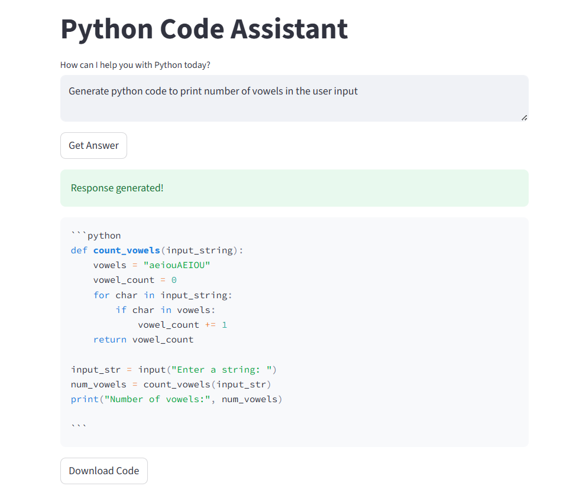
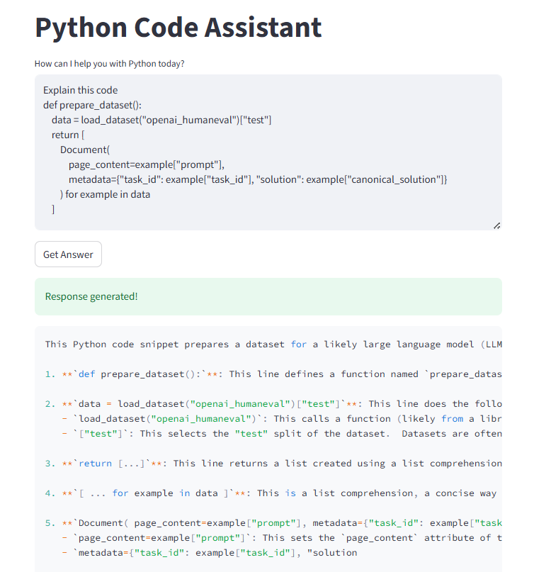

# Python-Code-Assistant

An AI-powered assistant that generates and explains Python code based on user queries.
It integrates Retrieval-Augmented Generation (RAG), LangGraph for workflow orchestration, Qdrant as a vector store, HuggingFace CodeBERT embeddings, and Gemini models accessed via the OpenAI API.

## Features
**- Code Generation:** Provide a Python task, and it generates the function for you.

**- Code Explanation:** Paste code with "explain" in your message, and it returns a detailed explanation.

**- RAG-based Retrieval:** Uses similar programming examples from the openai_humaneval dataset.

**- Embeddings:** Uses microsoft/codebert-base to embed programming tasks.

**- LangGraph:** Controls the flow between generation/explanation using graph-based state transitions.

**- Vector Store:** Powered by Qdrant for efficient similarity search.

## How to Run
1- Clone the repo:

~~~
git clone https://github.com/your-username/python-code-assistant.git
cd python-code-assistant
~~~

2- Install requirements:

~~~
pip install -r requirements.txt
~~~

3- Run the app:

~~~
streamlit run app.py
~~~

## Screenshots 
**1- For Generation**

**2- For Explaination**

